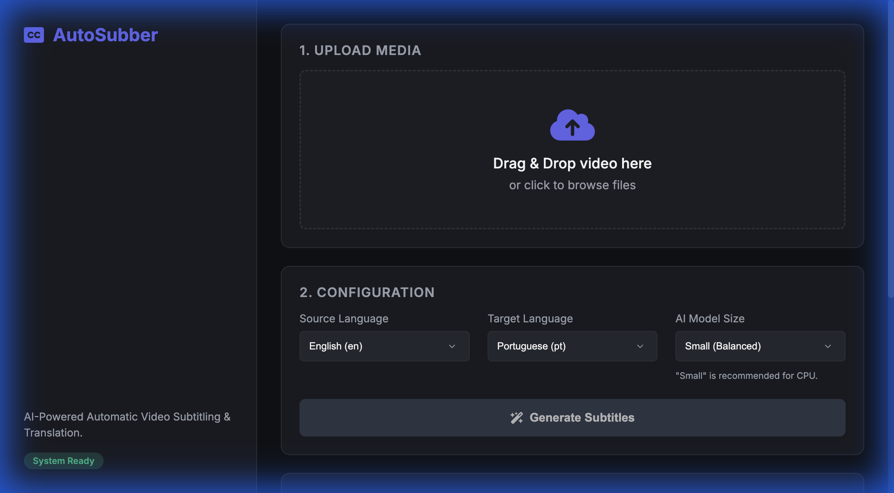

# AutoSubber: Automatic Video Subtitle Generator

[](https://www.python.org/downloads/)
[](https://opensource.org/licenses/MIT)

## Overview

AutoSubber is a powerful local tool that automatically generates timed subtitles for any video. It transcribes audio using OpenAI's **Whisper** and translates it using Facebook's **M2M100**, all running privacy-friendly on your own machine.

**New:** Now features a modern **Web Interface** for easy drag-and-drop usage!

### Features
-   **Web UI**: Modern, dark-themed drag-and-drop interface.
-   **Audio Transcription**: Accurate timestamps using Whisper.
-   **Multi-Language**: Translates to/from 100+ languages.
-   **Formats**: Outputs SRT subtitles, TXT transcripts, and video with embedded subtitles.
-   **GPU/CPU Support**: Automatically detects CUDA for faster processing.



## Installation

1.  **Clone the Repository**:
    ```bash
    git clone https://github.com/danielthejoker18/AutoSubber.git
    cd AutoSubber
    ```

2.  **Install Dependencies**:
    Requires Python 3.8+.
    ```bash
    pip install -r requirements.txt
    pip install flask  # Required for Web UI
    ```
    *Note: For GPU support, install PyTorch with CUDA: `pip install torch --index-url https://download.pytorch.org/whl/cu121`*

3.  **Install FFmpeg**:
    -   **Mac**: `brew install ffmpeg`
    -   **Windows**: `choco install ffmpeg`
    -   **Linux**: `sudo apt install ffmpeg`

## Usage

### 🚀 Option 1: Web Interface (Recommended)

The easiest way to use AutoSubber.

1.  **Start the Server**:
    ```bash
    python app.py
    ```
2.  **Open Browser**: Go to `http://localhost:5000`
3.  **Upload & Video**: Drag your file, select languages/model, and click "**Generate Subtitles**".

### 💻 Option 2: Command Line (CLI)

For advanced users or automation.

```bash
python main.py <input_file> <output_video> <src_lang> <tgt_lang> [--srt-only]
```

**Example:**
```bash
python main.py video.mp4 video_subbed.mp4 en pt
```

## Supported Languages

AutoSubber uses **Whisper** for transcription (~99 languages) and **M2M100** for translation (100 languages).

**Common Codes**:
-   `en` (English)
-   `pt` (Portuguese)
-   `es` (Spanish)
-   `fr` (French)
-   `de` (German)
-   `ja` (Japanese)
*(See model documentation for full lists)*

## Troubleshooting

-   **Process Stuck?**: Transcription is CPU-intensive. Use the "Tiny" or "Small" model in the Web UI if your computer is slow.
-   **FFmpeg Not Found**: Ensure FFmpeg is installed and in your system PATH.

## License
MIT License. Built with ❤️ by Daniel.

---

# AutoSubber: Gerador Automático de Legendas

[](https://www.python.org/downloads/)
[](https://opensource.org/licenses/MIT)

## Visão Geral

O AutoSubber é uma ferramenta local que gera legendas automáticas para vídeos. Ele transcreve o áudio usando o **Whisper** da OpenAI e traduz usando o **M2M100** do Facebook, rodando com total privacidade na sua máquina.

**Novo:** Agora conta com uma **Interface Web** moderna de arrastar e soltar!

### Funcionalidades
-   **Interface Web**: Design moderno, tema escuro e fácil de usar.
-   **Transcrição de Áudio**: Timestamps precisos com Whisper.
-   **Multi-Idioma**: Traduz para mais de 100 idiomas.
-   **Formatos**: Gera legendas SRT, texto TXT e vídeo com legenda embutida.
-   **Suporte GPU/CPU**: Detecta automaticamente CUDA para processamento rápido.

## Instalação

1.  **Clone o Repositório**:
    ```bash
    git clone https://github.com/danielthejoker18/AutoSubber.git
    cd AutoSubber
    ```

2.  **Instale as Dependências**:
    Requer Python 3.8+.
    ```bash
    pip install -r requirements.txt
    pip install flask  # Necessário para a Interface Web
    ```
    *Nota: Para suporte a GPU, instale PyTorch com CUDA: `pip install torch --index-url https://download.pytorch.org/whl/cu121`*

3.  **Instale FFmpeg**:
    -   **Mac**: `brew install ffmpeg`
    -   **Windows**: `choco install ffmpeg`
    -   **Linux**: `sudo apt install ffmpeg`

## Uso

### 🚀 Opção 1: Interface Web (Recomendado)

A maneira mais fácil de usar o AutoSubber.

1.  **Inicie o Servidor**:
    ```bash
    python app.py
    ```
2.  **Abra o Navegador**: Acesse `http://localhost:5000`
3.  **Use**: Arraste seu vídeo, escolha os idiomas/modelo e clique em "**Generate Subtitles**".

### 💻 Opção 2: Linha de Comando (CLI)

Para usuários avançados ou automação.

```bash
python main.py <arquivo_entrada> <video_saida> <idioma_origem> <idioma_destino> [--srt-only]
```

**Exemplo:**
```bash
python main.py video.mp4 video_legendado.mp4 en pt
```

## Idiomas Suportados

O AutoSubber usa **Whisper** para transcrição (~99 idiomas) e **M2M100** para tradução (100 idiomas).

**Códigos Comuns**:
-   `en` (Inglês)
-   `pt` (Português)
-   `es` (Espanhol)
-   `fr` (Francês)
-   `de` (Alemão)
-   `ja` (Japonês)
*(Consulte a documentação dos modelos para listas completas)*

## Solução de Problemas

-   **Processo Travado?**: A transcrição consome muita CPU. Use o modelo "Tiny" ou "Small" na Interface Web se seu computador estiver lento.
-   **FFmpeg Não Encontrado**: Certifique-se de que o FFmpeg está instalado e no PATH do sistema.

## Licença
Licença MIT. Feito com ❤️ por Daniel.